// mermaid-architecture.md - Diagramas da Arquitetura do Projeto

# 🎨 DIAGRAMAS MERMAID - TikTok Global Trends v2.0

## 1. ARQUITETURA DE SISTEMA (Visão Geral)

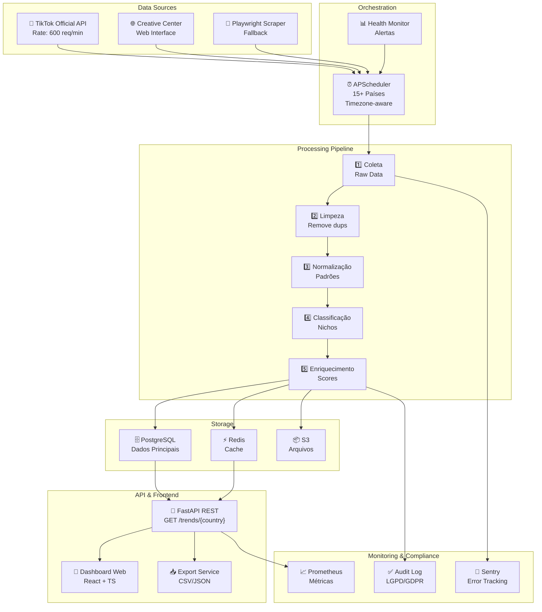

## 2. FLUXO DE DADOS - HAPPY PATH

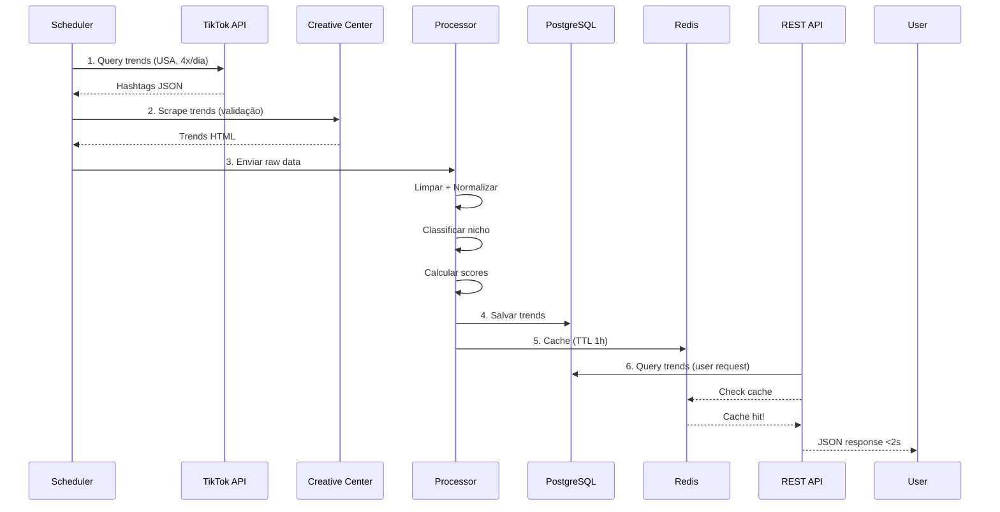

## 3. FLUXO DE DADOS - FALLBACK PATH

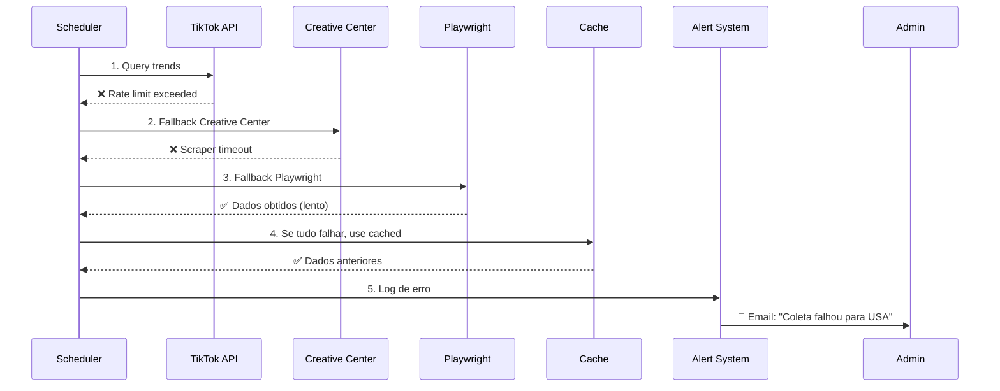

## 4. MODELO DE DADOS - RELACIONAMENTOS

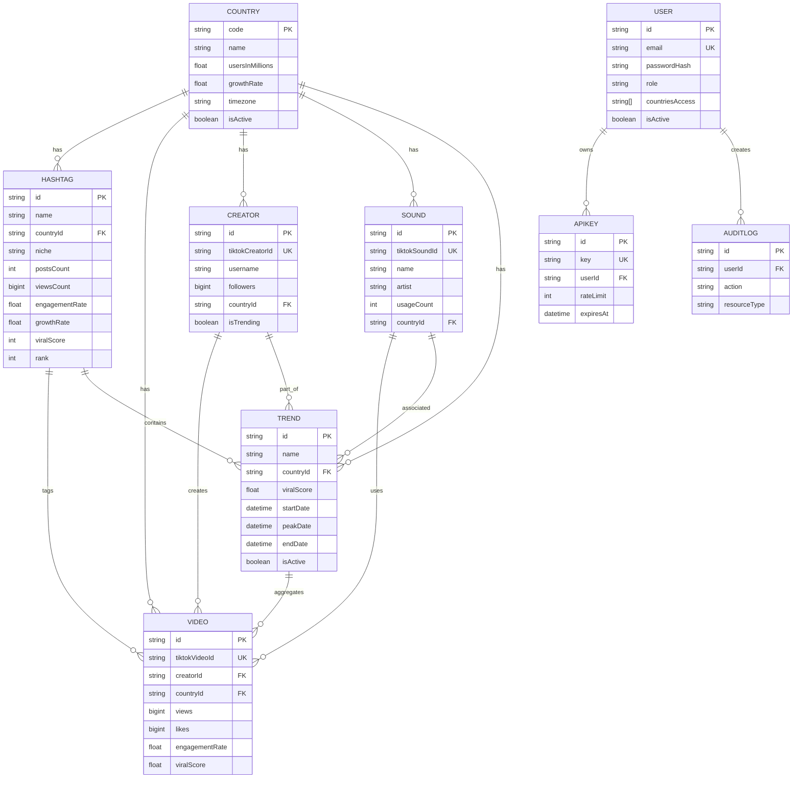

## 5. PIPELINE DE PROCESSAMENTO DE DADOS

```mermaid
graph LR
    subgraph Input["📥 INPUT"]
        RAW["Raw JSON<br/>from API/Scraper"]
    end
    
    subgraph Clean["🧹 CLEAN"]
        REM["Remove<br/>Duplicates"]
        NULL["Remove<br/>Nulls"]
        VALID["Validate<br/>Format"]
    end
    
    subgraph Norm["📊 NORMALIZE"]
        CASE["Lowercase<br/>Keys"]
        ENC["UTF-8<br/>Encoding"]
        TZ["Timezone<br/>Conversion"]
    end
    
    subgraph Class["🏷️ CLASSIFY"]
        KEYWORDS["Match<br/>Keywords"]
        SCORE["Confidence<br/>Score"]
        MULTI["Multi-niche<br/>Support"]
    end
    
    subgraph Enrich["✨ ENRICH"]
        CALC["Calculate<br/>Metrics"]
        TREND["Detect<br/>Trends"]
        RANK["Compute<br/>Rank"]
    end
    
    subgraph Output["📤 OUTPUT"]
        SAVE["Save to DB<br/>+ Cache"]
        NOTIFY["Notify<br/>Dashboard"]
    end
    
    RAW --> REM
    REM --> NULL
    NULL --> VALID
    VALID --> CASE
    CASE --> ENC
    ENC --> TZ
    TZ --> KEYWORDS
    KEYWORDS --> SCORE
    SCORE --> MULTI
    MULTI --> CALC
    CALC --> TREND
    TREND --> RANK
    RANK --> SAVE
    SAVE --> NOTIFY
```

## 6. ORQUESTRAÇÃO MULTI-PAÍS (SCHEDULER)

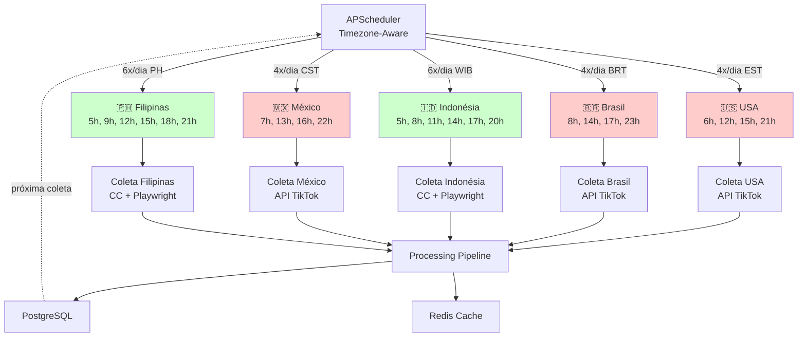

## 7. CAMADAS DA APLICAÇÃO

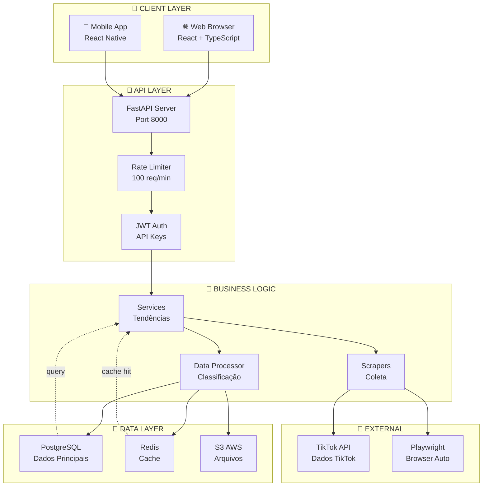

## 8. CONFORMIDADE E SEGURANÇA

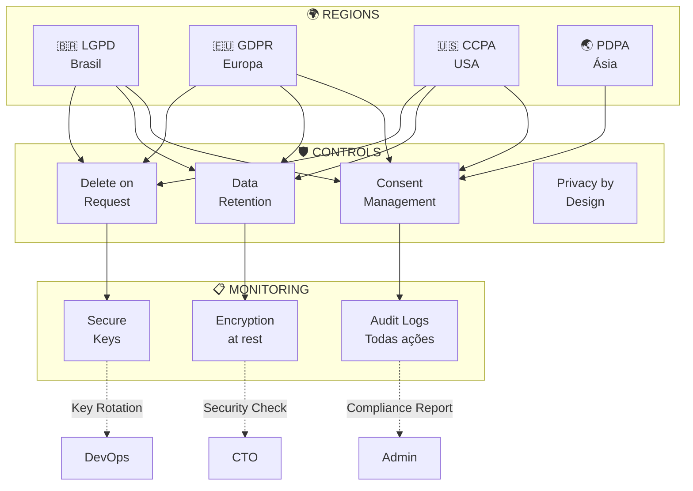

## 9. DEPLOYMENT ARCHITECTURE

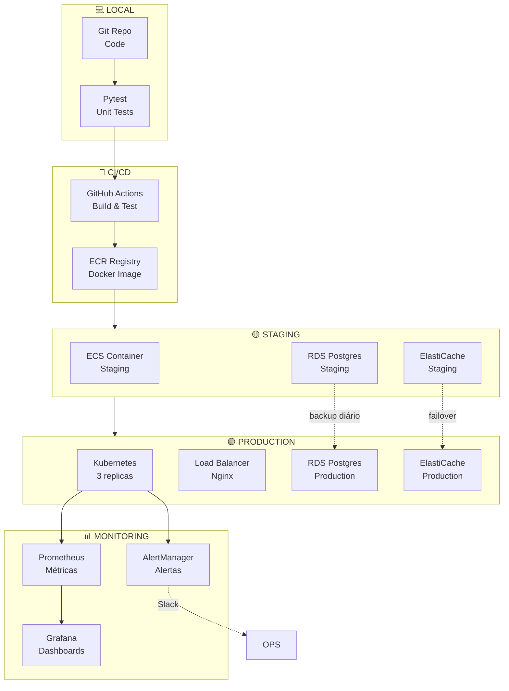

## 10. ESTADO DA APLICAÇÃO - MÁQUINA DE ESTADOS

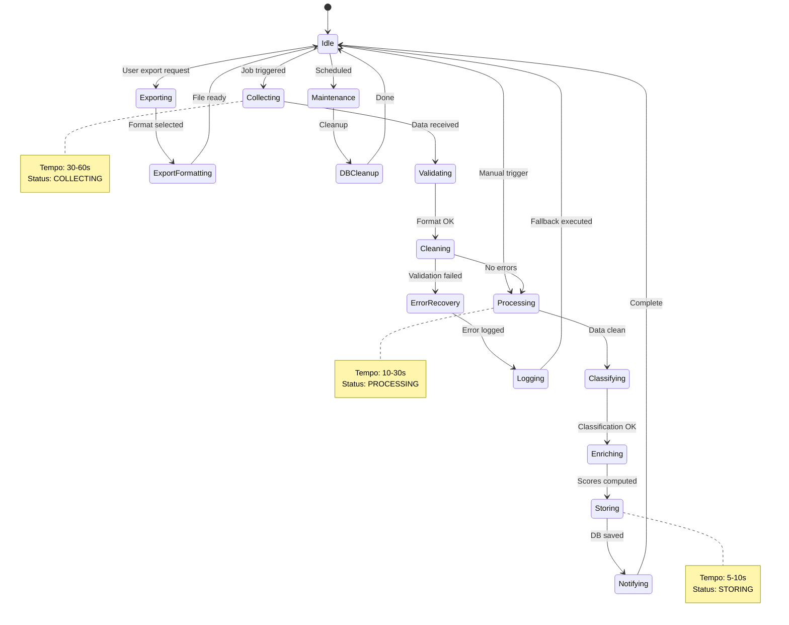

## 11. MATRIZ DE COMPATIBILIDADE REGIONAL

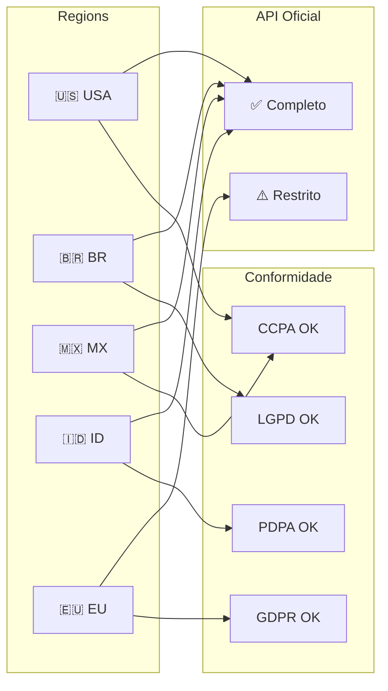

## 12. FLUXO DE DESENVOLVEDOR - WORKFLOW

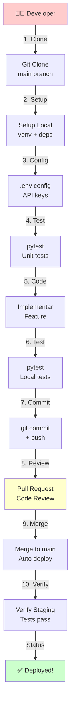

---

**Todos os 12 diagramas Mermaid estão prontos para use em sua documentação!**